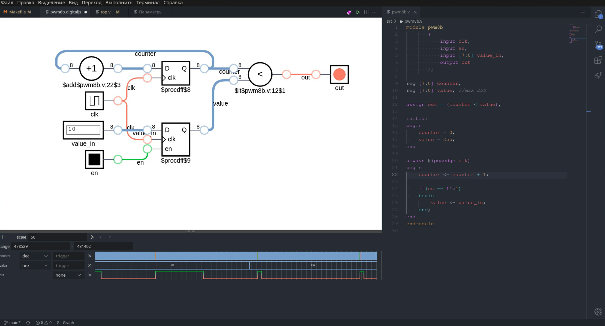

# FPGACode-ide

[**FPGACode-ide**](https://github.com/MuratovAS/FPGACode-ide) -> [IceSugar-riscv](https://github.com/MuratovAS/icesugar-riscv) -> [IceSugar-tv80](https://github.com/MuratovAS/icesugar-z80) -> [IceSugar-6502](https://github.com/MuratovAS/icesugar-6502)



This repository contains a simple project for `Icebreaker fpga` built on `Makefile` and open `Toolchain`, which allows us to use `code` as a full -fledged development environment.

As an editor of the code can be absolutely anything from `vim` to `vscode`, there is no binding to the editor. I am using `uncoded`. It is `*code*` that editor makes it possible to conveniently visualize the development process, due to extensions.

## Installation of dependencies

For example, consider installation on Ubuntu

```bash
sudo apt install openjdk-8-jdk openjdk-8-jre #It is necessary for impulse and verilog-format
sudo apt install curl jq #It is necessary for installation toolchain
sudo apt install code #Any variety of VSCODE
```

## First start

The first thing to do is to install `toolchain`. Installation to the Directory `/opt/fpga`. The directory can be configured in `Makefile`.
The list of established components is configured in `./toolchain.txt`
```bash
make toolchain
```
Next, you can establish the necessary expansion.

## Extensions for Code

Basic extensions:
|Name               |Developer   |Description           |URL |
|-------------------|------------|----------------------|----|
|Verilog-HDL >=1.5.4|mshr-h      |Highlight and lint    |[🔽](https://github.com/MuratovAS/vscode-verilog-hdl-support)|
|Impulse            |toem-de     |VCD visualization     |[✅](https://open-vsx.org/extension/toem-de/impulse)|

Additional extensions:
|Name             |Developer    |Description       |Notes                 |URL |
|-----------------|-------------|------------------|----------------------|----|
|TODO Highlight   |wayou        |Highlight notes   |Just a useful thing   |[✅](https://open-vsx.org/extension/wayou/vscode-todo-highlight)|
|Task Buttons     |spencerwmiles|Buttons in bar    |Just a useful thing   |[✅](https://github.com/spencerwmiles/vscode-task-buttons)|

Analogue extensions:
|Name             |Developer   |Description           |Notes                 |URL |
|-----------------|------------|----------------------|----------------------|----|
|DigitalJS        |yuyichao    |Interactive simulator |                      |[✅](https://open-vsx.org/extension/yuyichao/digitaljs)|
|WaveTrace        |wavetrace   |VCD visualization     |Analogue `Impulse`    |[⬇️](https://marketplace.visualstudio.com/items?itemName=wavetrace.wavetrace)|
|Verilog Highlight|tzylee      |Highlight syntax      |Analogue `Verilog-HDL`|[⬇️](https://marketplace.visualstudio.com/items?itemName=tzylee.verilog-highlight)|

## Usage

The commands can be executed manually in the terminal as well as through the `Task menu` in `Code`

```bash
make all        #Project assembly
make synthesis  #Synthesis RTL
make sim        #Perform Testbench
make flash      #Flash ROM
make prog       #Flash SRAM
make clean      #Cleaning the assembly of the project
make formatter  #Perform code formatting
make toolchain  #Install assembly tools
```

## Project structure

- .vscode - Directory сonfiguration for vscode
    - settings.json - Contains Linter settings
    - tasks.json - Contains instructions for launching Makefile
- build - Directory of assembly artifacts
    - *.vcd - The file contains temporary diagrams (result of modeling)
    - *.bin - The final firmware file
- src - Directory of source files
    - *.v - Source code
    - *_tb.v - Test Bench
    - top.v - Initial file
- toolchain - Directory of scripts for the assembly of Toolchain
- .verilog-format - Code style configuration file
- *.pcf - Pin planner
- Makefile - Assembly system
- toolchain.txt - List of tools used

## Turn on hot keys

There was no simple way to reassign the keys for the working area. For this reason, a change in the global configuration will be required. This can be done by adding to the file `keybindings.json`

```json
{
    "key": "alt+shift+a",
    "command": "workbench.action.tasks.runTask",
    "args": "PRJ: make"
},
```

## Permission for USB

First you need to find out the `VendorID` and `ProductID` of our adapter. This can be done with the following command:
~~~
lsusb | grep UART
~~~

Example:
~~~bash 
 Bus 003 Device 011: ID 0403:6001 Future Technology Devices International, Ltd FT232 USB-Serial (UART) IC
~~~

Remember the values after the ID abbreviation, they will be useful to us later.

Create a file in `/etc/udev/rules.d/`
~~~bash
sudo nano /etc/udev/rules.d/10-ft232.rules
~~~

As a name, it is convenient to indicate the name of the chip installed in the adapter. In my case it is `FT232`.

Now we add content in the window that opens (we change `idVendor` and `idProduct`, we got these values in the previous paragraph):
~~~bash
SUBSYSTEMS=="usb", ATTRS{idVendor}=="0403", ATTRS{idProduct}=="6001", \
    MODE:="0666", GROUP:="users",\
    SYMLINK+="ft232_%n"
~~~
With this entry, we set write and read rights to the USB device `0403:6001` for ordinary users. We also tell udev to create a symbolic link to it called `ft232_xxx`.

Restart udev.
~~~bash
sudo udevadm control --reload-rules
~~~

We check the rights to our device.
~~~bash
$ ls -l /dev/ | grep USB
lrwxrwxrwx. 1 root root             7 янв 25 15:09 ft232_0 -> ttyUSB0
crw-rw-rw-. 1 root users     188,   0 янв 25 15:09 ttyUSB0
~~~

## Plans for the future

TODO: 
 - Make IceSugar-6502
 - Improve the testbench system
